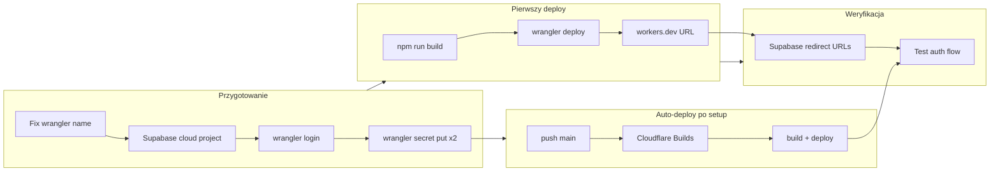
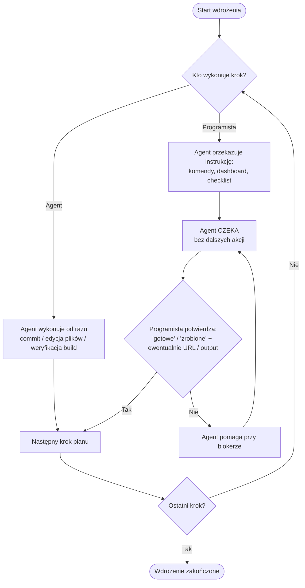
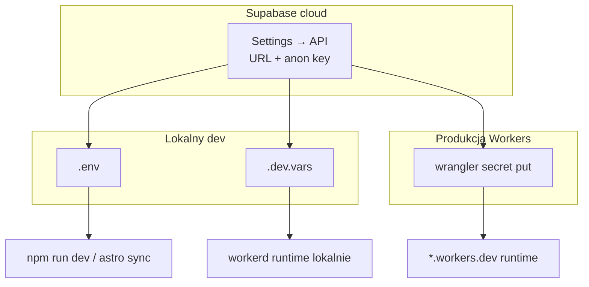

# Pierwsze wdrożenie OZC-cal na Cloudflare Workers

## Kontekst

Repozytorium jest już skonfigurowane pod Cloudflare Workers (Astro 6 SSR + `@astrojs/cloudflare`). Brakuje trzech rzeczy przed produkcją:

1. **Konfiguracja nazwy workera** — [`wrangler.jsonc`](../../wrangler.jsonc) nadal ma `name: "10x-astro-starter"` (wymaga zmiany na `ozc-cal` przed deployem, wg risk register w [infrastructure.md](../foundation/infrastructure.md)).
2. **Cloud Supabase** — wybrałeś utworzenie nowego projektu; lokalny `http://127.0.0.1:54321` nie zadziała z Workers.
3. **Sekrety runtime** — `SUPABASE_URL` i `SUPABASE_KEY` muszą trafić do Cloudflare via `wrangler secret put` (runtime Workers).
4. **Auto-deploy z GitHub** — push na `main` uruchamia build i deploy przez **Cloudflare Builds** (nie przez GitHub Actions deploy job — pełny CI/CD pipeline dojdzie później).



### Podział odpowiedzialności: GitHub vs Cloudflare

| Warstwa | Narzędzie | Trigger | Co robi | Status |
|---------|-----------|---------|---------|--------|
| **Quality gate** | GitHub Actions ([`.github/workflows/ci.yml`](../../.github/workflows/ci.yml)) | push/PR na `main` | `lint` + `build` (bez deployu) | Już w repo; naprawić trigger `master` → `main` |
| **Deploy produkcyjny** | **Cloudflare Builds** | push na `main` | `npm ci` → `npm run build` → deploy workera | **Do skonfigurowania w tej iteracji** |
| **Pełny CI/CD** | (później) | — | staging, approval gates, preview policy, rollback automation | Poza zakresem |

GitHub Actions **nie** deployuje — tylko weryfikuje kod. Cloudflare Builds **deployuje** po merge/pushu na `main`.

## Model wykonania (iteracyjny)

Plan realizujemy **krok po kroku**, z wyraźnym podziałem ról. Agent **nie przeskakuje** do kolejnego kroku, dopóki programista nie potwierdzi ukończenia bieżącego kroku programisty.



### Zasady dla agenta

1. **Krok agenta** — wykonuj samodzielnie (edycja repo, `npm run build` weryfikacyjny, commit jeśli poproszono). Po zakończeniu krótko podsumuj i **od razu przekaż następny krok programisty**.
2. **Krok programisty** — przekaż przez LLM: co zrobić, gdzie (terminal vs dashboard), jak zweryfikować sukces, czego **nie** commitować. **Zatrzymaj się** — nie przechodź dalej.
3. **Potwierdzenie programisty** — programista pisze np. „gotowe”, „krok 2 zrobiony”, podaje `workers.dev` URL lub `project-ref`. Dopiero wtedy agent przechodzi do kolejnego kroku.
4. **Bloker** — jeśli programista zgłasza błąd, agent pomaga w debugowaniu **w ramach tego samego kroku**; po rozwiązaniu czeka na potwierdzenie przed przejściem dalej.
5. **Sekrety** — agent **nigdy** nie prosi o wklejenie kluczy w czat; programista ustawia je lokalnie (`.env`, `.dev.vars`) i w dashboardach.

### Kroki iteracyjne (kolejność)

| # | Wykonawca | Co | Potwierdzenie od programisty |
|---|-----------|-----|------------------------------|
| **0** | **Programista** | CLI: `nvm use`, `npm ci`, `supabase login`, `wrangler login`, `cp .env.example` → `.env` + `.dev.vars` | „CLI skonfigurowane” |
| **1** | **Agent** | Zmiana `wrangler.jsonc`, `package.json`, CI `main`; opcjonalnie weryfikacja `npm run build` | — (agent kończy sam; programista robi push jeśli chce) |
| **2** | **Programista** | Cloud Supabase: projekt, API keys → `.env` / `.dev.vars`, auth settings, lokalny test `npm run dev` | „Supabase gotowy” (+ opcjonalnie `project-ref`, bez kluczy w czacie) |
| **3** | **Programista** | `wrangler secret put` ×2, `wrangler secret list` | „Sekrety CF ustawione” |
| **4** | **Programista** | Pierwszy deploy: `npm run build && npx wrangler deploy` | „Deploy OK” + **pełny URL** `*.workers.dev` |
| **5** | **Programista** | Supabase redirect URLs (Site URL + wildcards) | „Redirect URLs ustawione” |
| **6** | **Programista** | Smoke test auth na produkcji (checklist Fazy 5) | „Smoke test OK” (lub opis co nie działa) |
| **7** | **Programista** | Cloudflare Builds: GitHub `main`, build env vars, weryfikacja push → deploy | „Auto-deploy działa” |

**Szablony wiadomości agenta po każdym kroku programisty:**

> **Twój krok (N/7):** [tytuł]  
> [instrukcje + komendy / ścieżki w dashboardzie]  
> **Jak potwierdzić:** napisz „gotowe” + [co konkretnie podać, np. URL workera].  
> Nie przechodzę dalej, dopóki nie potwierdzisz.

Po kroku agenta (1):

> **Zrobiłem:** [lista zmian w repo]  
> **Twój krok (2/7):** [następna instrukcja dla programisty…]

Szczegóły techniczne każdego kroku programisty — w sekcjach faz poniżej (CLI reference + Fazy 0–6).

## Konfiguracja CLI i narzędzi (krok 0 — **Programista**)

> **Wykonawca:** programista. Agent tylko przekazuje instrukcję i **czeka** na „CLI skonfigurowane”.

Wszystkie poniższe kroki wykonujesz lokalnie w katalogu projektu (`/Users/Pawel/WebApps/ozc-cal`). CLI są już w `devDependencies` projektu — **nie instaluj globalnie** `wrangler` ani `supabase`; używaj `npx`.

### 1. Node.js i npm

```bash
cd /Users/Pawel/WebApps/ozc-cal
nvm install    # czyta wersję z .nvmrc → 22.14.0
nvm use
node -v        # oczekiwane: v22.14.0
npm ci         # instaluje zależności, w tym wrangler ^4.90 i supabase ^2.23
```

### 2. Pliki środowiskowe lokalne

Projekt rozdziela sekrety na dwa pliki (oba gitignored):

| Plik | Używany przez | Kiedy |
|------|---------------|-------|
| `.env` | Astro / Node (np. `astro sync`) | lokalny dev, opcjonalnie CI |
| `.dev.vars` | Wrangler / workerd (`npm run dev`) | lokalny dev w runtime Cloudflare |

```bash
cp .env.example .env
cp .env.example .dev.vars
```

W obu plikach ustaw **te same wartości** cloud Supabase (po utworzeniu projektu w Fazie 1):

```
SUPABASE_URL=https://<project-ref>.supabase.co
SUPABASE_KEY=<anon-public-key>
```

**Nigdy** nie commituj `.env`, `.dev.vars` ani klucza `service_role`.

### 3. Supabase CLI

Supabase CLI (`npx supabase`) służy do zarządzania projektem z terminala. Na pierwsze wdrożenie potrzebujesz **logowania** i **powiązania** repo z cloud projektem (opcjonalnie, ale ułatwia późniejsze migracje).

**Instalacja / weryfikacja** (już w projekcie):

```bash
npx supabase --version
```

**Logowanie** (otworzy przeglądarkę):

```bash
npx supabase login
```

**Utworzenie cloud projektu z CLI** (alternatywa do dashboardu):

```bash
npx supabase projects create ozc-cal \
  --org-id <twoje-org-id> \
  --region eu-central-1 \
  --db-password '<silne-haslo-db>'
```

Org ID znajdziesz: `npx supabase orgs list`. Region `eu-central-1` (Frankfurt) — sensowny domyślny dla PL; możesz też utworzyć projekt w [dashboardzie](https://supabase.com/dashboard) bez CLI.

**Powiązanie lokalnego repo z cloud projektem**:

```bash
npx supabase link --project-ref <project-ref>
```

`<project-ref>` to fragment URL projektu: `https://<project-ref>.supabase.co`. Hasło DB podajesz interaktywnie (to z kroku create).

**Pobranie kluczy z CLI** (alternatywa do dashboardu Settings → API):

```bash
npx supabase projects api-keys --project-ref <project-ref>
```

Skopiuj `anon` key (nie `service_role`) do `.env` i `.dev.vars`.

**Weryfikacja połączenia lokalnej aplikacji**:

```bash
npm run dev
# otwórz http://localhost:4321/auth/signup — test rejestracji przed deployem
```

Folder `supabase/` w repo już istnieje ([`supabase/config.toml`](../../supabase/config.toml)); `npx supabase init` **nie jest potrzebne**. Migracje na MVP nie są wymagane — auth korzysta z wbudowanej tabeli `auth.users`.

**Lokalny Supabase (Docker) — opcjonalnie, nie do produkcji:**

Jeśli chcesz osobno dev offline: `npx supabase start` (wymaga Docker ~7 GB RAM). Wtedy `.env` / `.dev.vars` mają `http://127.0.0.1:54321`. **Produkcja Workers musi używać cloud URL** — nie localhost.

### 4. Wrangler CLI (Cloudflare)

Wrangler (`npx wrangler`) deployuje worker i zarządza sekretami runtime.

**Logowanie** (otworzy przeglądarkę, wybierz konto Cloudflare):

```bash
npx wrangler login
```

**Weryfikacja konta**:

```bash
npx wrangler whoami
```

**Sprawdzenie konfiguracji workera** (po zmianie `name` w Fazie 0):

```bash
npx wrangler validate
```

**Sekrety produkcyjne** (runtime Workers — osobno od plików lokalnych):

```bash
npx wrangler secret put SUPABASE_URL    # wklej https://<ref>.supabase.co
npx wrangler secret put SUPABASE_KEY    # wklej anon key
npx wrangler secret list                # potwierdź oba sekrety (wartości ukryte)
```

Sekrety można też dodać w dashboardzie: **Workers & Pages → ozc-cal → Settings → Variables and Secrets → Encrypt**.

**Przydatne komendy po deployu**:

```bash
npx wrangler deployments list   # historia wdrożeń
npx wrangler tail               # live logi runtime
npx wrangler rollback           # cofnięcie do poprzedniej wersji
```

Na **kroku 0** wystarczy `wrangler login` + `whoami`. Komendy `secret put` — dopiero w **kroku 3**.

### 5. Mapa: gdzie trafiają sekrety



| Zmienna | Lokalnie | Runtime Workers | Build Cloudflare Builds | GitHub Actions (lint/build) |
|---------|----------|-----------------|-------------------------|----------------------------|
| `SUPABASE_URL` | `.env` + `.dev.vars` | `wrangler secret` (Encrypt) | Variable (Encrypt) — build-time | repo secret |
| `SUPABASE_KEY` | `.env` + `.dev.vars` | `wrangler secret` (Encrypt) | Variable (Encrypt) — build-time | repo secret |

- **Runtime secrets** (`wrangler secret put`) — aplikacja na `*.workers.dev` w runtime.
- **Build variables** (Cloudflare Builds dashboard) — `astro build` wymaga ich przy kompilacji (`astro:env` schema); ustaw te same wartości co runtime.
- **GitHub secrets** — tylko dla jobu lint/build w Actions; **nie** zastępują ani runtime, ani Cloudflare Builds.

**Potwierdzenie kroku 0:** napisz „CLI skonfigurowane”. Wartości Supabase w `.env` uzupełnisz w kroku 2 — na kroku 0 wystarczą puste pliki z `.env.example`.

## Faza 0 — Poprawki w repozytorium (krok 1 — **Agent**)

> **Wykonawca:** agent — wykonuje **sam**, bez czekania (po potwierdzeniu startu planu i kroku 0 programisty).

| Plik | Zmiana | Powód |
|------|--------|-------|
| [`wrangler.jsonc`](../../wrangler.jsonc) | `"name": "ozc-cal"` | URL produkcyjny + nazwa workera w Cloudflare Builds |
| [`package.json`](../../package.json) | `"name": "ozc-cal"` | Spójność z projektem |
| [`.github/workflows/ci.yml`](../../.github/workflows/ci.yml) | `branches: [main]` zamiast `master` | Repo używa `main`; bez tego GitHub Actions nie startuje |

Po zmianach agent może uruchomić `npm run build` jako sanity check. Następnie **zatrzymuje się** i przekazuje **krok 2** (Supabase) — **czeka** na potwierdzenie programisty.

Cloudflare Builds czyta [`wrangler.jsonc`](../../wrangler.jsonc) — nie potrzebuje osobnego pliku konfiguracyjnego deployu.

## Faza 1 — Cloud Supabase (krok 2 — **Programista**)

> **Wykonawca:** programista. Agent przekazuje instrukcję i **czeka** na „Supabase gotowy” (bez kluczy w czacie).

Możesz utworzyć projekt **dashboardem** lub **CLI** — instrukcje CLI w sekcji [Supabase CLI](#3-supabase-cli) powyżej.

### Dashboard (krok po kroku)

1. Wejdź na [supabase.com/dashboard](https://supabase.com/dashboard) → **New project**.
2. Ustaw:
   - **Name**: `ozc-cal`
   - **Database password**: zapisz bezpiecznie (potrzebne przy `supabase link`)
   - **Region**: `Central EU (Frankfurt)` — `eu-central-1`
3. Poczekaj ~2 min na provisioning projektu.
4. **Project Settings → API** (lewy dolny róg):
   - **Project URL** → wartość `SUPABASE_URL`
   - **Project API keys → anon public** → wartość `SUPABASE_KEY`
5. Wklej obie wartości do `.env` i `.dev.vars` (patrz [pliki środowiskowe](#2-pliki-środowiskowe-lokalne)).
6. **Authentication → Providers → Email**: upewnij się, że **Enable Email provider** jest włączone.
7. **Authentication → Sign In / Providers → Email**: na MVP **wyłącz** „Confirm email” (szybsze testy sign-up bez linku w skrzynce).
8. **Authentication → URL Configuration** — **pomiń na razie** Site URL i Redirect URLs; uzupełnisz w Fazie 4 po deployu.

### Weryfikacja lokalna przed deployem

```bash
npm run dev
# http://localhost:4321/auth/signup → załóż testowe konto
# http://localhost:4321/auth/signin → zaloguj się
# http://localhost:4321/dashboard → powinno działać po logowaniu
```

Migracje DB na tym etapie **nie są wymagane** — aplikacja korzysta tylko z `auth.users` ([README.md](../../README.md), brak plików w `supabase/migrations/`).

**Potwierdzenie kroku 2:** „Supabase gotowy” (+ opcjonalnie `project-ref`).

## Faza 2 — Cloudflare: sekrety runtime (krok 3 — **Programista**)

> **Wykonawca:** programista. Agent **czeka** na „Sekrety CF ustawione”. (`wrangler login` powinien być już z kroku 0.)

Szczegóły komend: sekcja [Wrangler CLI](#4-wrangler-cli-cloudflare) powyżej.

1. `nvm use` (jeśli nowa sesja terminala).
2. `npx wrangler whoami` → potwierdź konto (login z kroku 0).
3. `npx wrangler secret put SUPABASE_URL` i `SUPABASE_KEY` — wartości **cloud** z kroku 2 (nie localhost).
4. `npx wrangler secret list` → oba sekrety widoczne.

Sekrety są powiązane z workerem `ozc-cal`. Lokalny dev nadal używa `.dev.vars`, nie Worker secrets.

**Potwierdzenie kroku 3:** „Sekrety CF ustawione”.

## Faza 3 — Pierwszy deploy manualny (krok 4 — **Programista**)

> **Wykonawca:** programista. Agent **czeka** na „Deploy OK” + **pełny URL** `*.workers.dev`.

Pierwszy `wrangler deploy` **bootstrapuje** workera i daje URL do konfiguracji Supabase. Po Fazie 6 kolejne wdrożenia pójdą automatycznie z `main`.

```bash
npm ci
npm run build
npx wrangler deploy
```

Wrangler wypisze URL produkcyjny, np. `https://ozc-cal.<twoje-konto>.workers.dev`.

**Ważne:** nie używaj `--env staging` przy pierwszym deployu — nie ma jeszcze osobnych środowisk w `wrangler.jsonc`.

**Potwierdzenie kroku 4:** „Deploy OK” + URL, np. `https://ozc-cal.xxxx.workers.dev`.

## Faza 4 — Supabase: redirect URLs (krok 5 — **Programista**)

> **Wykonawca:** programista. Agent **czeka** na „Redirect URLs ustawione”.

Po poznaniu URL z Fazy 3 (np. `https://ozc-cal.twoj-subdomain.workers.dev`):

1. Supabase dashboard → **Authentication → URL Configuration**.
2. Ustaw:
   - **Site URL**: `https://ozc-cal.<account>.workers.dev` (dokładny URL z outputu `wrangler deploy`)
   - **Redirect URLs** — dodaj każdy URL w osobnej linii:
     - `https://ozc-cal.<account>.workers.dev/**` (wildcard dla podścieżek auth)
     - `http://localhost:4321/**` (lokalny dev Astro)
3. **Save**.

Jeśli sign-in na produkcji zwraca błąd redirect/cookie — najpierw sprawdź te URL-e, potem `npx wrangler tail`.

**Potwierdzenie kroku 5:** „Redirect URLs ustawione”.

## Faza 5 — Weryfikacja produkcji (krok 6 — **Programista**)

> **Wykonawca:** programista. Agent **czeka** na „Smoke test OK” lub opis problemu.

Checklist smoke test:

- [ ] Strona główna ładuje się na `*.workers.dev` (HTTP 200)
- [ ] `/auth/signup` — rejestracja nowego użytkownika
- [ ] `/auth/signin` — logowanie
- [ ] `/dashboard` — redirect na signin gdy niezalogowany; dostęp po logowaniu ([`src/middleware.ts`](../../src/middleware.ts))
- [ ] Sign-out działa (`/api/auth/signout`)

Jeśli auth pada z błędem cookie/redirect — typowy fix z risk register ([infrastructure.md](../foundation/infrastructure.md)): sprawdź Site URL w Supabase i uruchom `npx wrangler tail` do podglądu błędów runtime.

**Potwierdzenie kroku 6:** „Smoke test OK” (albo który punkt checklisty nie przeszedł).

## Rollback (runbook — na żądanie programisty)

```bash
npx wrangler deployments list
npx wrangler rollback
```

Rollback cofa tylko kod workera — **nie** zmiany w Supabase. Agent podaje ten runbook **tylko gdy programista zgłosi problem** — nie jest osobnym krokiem planu.

## Faza 6 — Cloudflare Builds (krok 7 — **Programista**)

> **Wykonawca:** programista. Ostatni krok — agent **czeka** na „Auto-deploy działa”.

Po pierwszym manualnym deployu (Faza 3) i ustawieniu sekretów (Faza 2) podłącz repozytorium GitHub, żeby **każdy push na `main`** budował i deployował worker automatycznie.

### Krok po kroku (dashboard)

1. **Workers & Pages** → worker `ozc-cal` → **Settings** → **Builds** (lub **Connect to Git** przy tworzeniu).
2. **Connect GitHub** → autoryzuj Cloudflare → wybierz repo `Pawel-Gnat/ozc-cal`.
3. **Production branch**: `main`.
4. **Build configuration**:
   - **Framework preset**: None (lub Auto-detect — Astro może być rozpoznany)
   - **Build command**: `npm run build`
   - **Deploy command**: (domyślnie puste — Cloudflare używa `wrangler.jsonc` i deployuje po buildzie; jeśli pole wymagane: `npx wrangler deploy`)
   - **Root directory**: `/` (repo root)
   - **Node.js version**: `22` (zgodnie z [`.nvmrc`](../../.nvmrc))
5. **Environment variables** (Build — **Encrypt**):
   - `SUPABASE_URL` = cloud URL z Fazy 1
   - `SUPABASE_KEY` = anon key z Fazy 1
   
   Te same wartości muszą być już ustawione jako **Worker secrets** (Faza 2) — build i runtime to dwa miejsca w dashboardzie.
6. **Save and Deploy** — Cloudflare zrobi pierwszy build z repo.

### Weryfikacja auto-deploy

1. Zrób drobną zmianę w repo (np. commit po Fazie 0 od agenta).
2. `git push origin main`.
3. W dashboardzie **Workers → ozc-cal → Deployments** — nowy deployment z commit SHA.
4. Sprawdź, że `*.workers.dev` nadal działa (Faza 5).

### Co NIE wchodzi w tę fazę

- Preview deploys na PR (można włączyć później w Builds → Preview deployments)
- Cloudflare Access na preview hostnames
- Approval gates przed produkcją
- GitHub Actions deploy job (`CLOUDFLARE_API_TOKEN`) — **nie potrzebny**, bo deploy robi Cloudflare Builds

**Potwierdzenie kroku 7:** „Auto-deploy działa” (push na `main` wywołał deployment w dashboardzie CF).

## Poza zakresem tej iteracji

Pełny proces CI/CD (staging, approval, rollback automation, preview policy) — dojdzie osobno. W tej iteracji:

- GitHub Actions: tylko lint + build (naprawiony trigger na `main`)
- Cloudflare Builds: auto-deploy produkcji na push `main`

Nadal poza zakresem:

- Preview deploys na PR
- Staging environment (`CLOUDFLARE_ENV=staging`)
- Custom domain
- GitHub Actions deploy step

## Podział odpowiedzialności (skrót)

Pełna kolejność iteracyjna — tabela w sekcji [Model wykonania](#model-wykonania-iteracyjny).

| Kroki | Wykonawca | Agent po zakończeniu |
|-------|-----------|----------------------|
| 0 — CLI | Programista | Czeka → przechodzi do kroku 1 |
| 1 — repo config | **Agent (sam)** | Przekazuje krok 2 → czeka |
| 2–7 — Supabase, CF, deploy, testy, Builds | Programista | Czeka po każdym → następny krok dopiero po potwierdzeniu |
